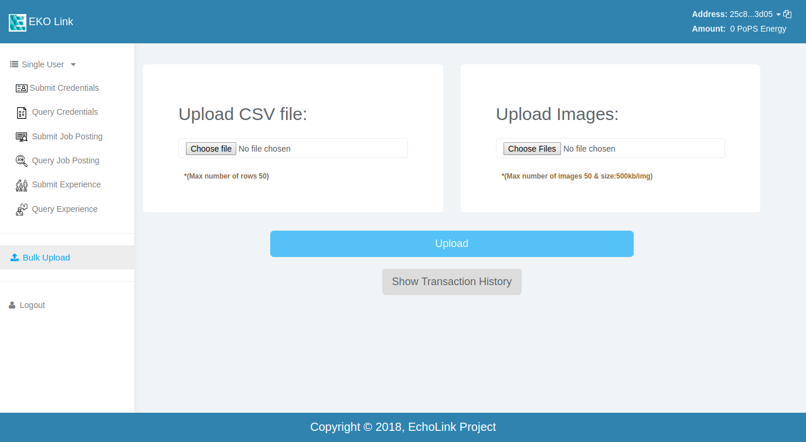
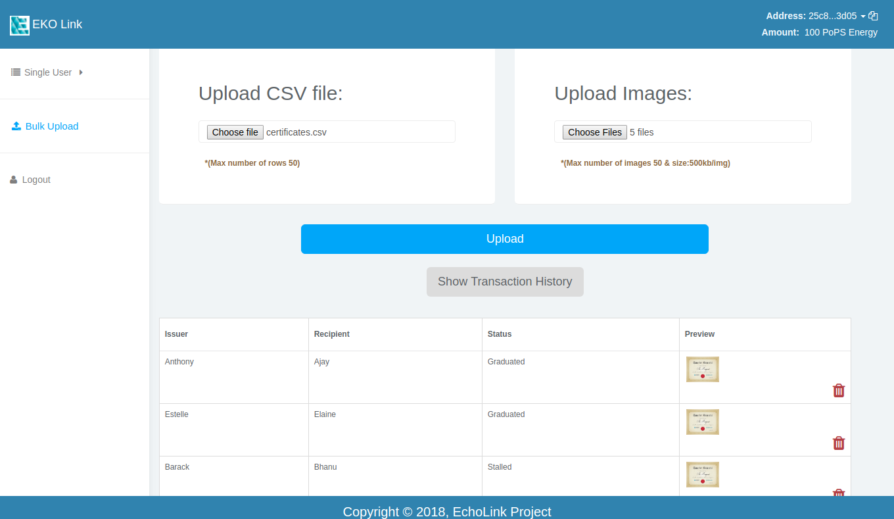

Bulk Upload Credentials
-----------------------

In this section of our application, we can upload the credentials as shown in our :doc:`upload credentials <credentials_upload>` demo in bulk.

As shown in the figure below, It displays two sections, one to upload a csv file and other to upload images.

In the first section, a ``.csv file < 50 entries`` containing fields as shown below can be uploaded. Please make sure that the image name field name must match with the images which you'll upload in the next section.

.. sourcecode:: bash

    Issuer      |     Recipient     |     Status      |   Image   |

eg:

.. sourcecode:: bash

    TechRacers  |      EchoLink      |     Success     |      image.png   |    

In second section, images can be uploaded with ``.png |.jpg |.jpeg`` format and  with :code:`file size < 500kb`. The images name should match with the entries in csv file uploaded.

As you can see above, once you select valid files the preview of the credentials will be displayed and you can choose to remove the credentials which you don't want to upload.

On clicking the :code:`Upload` button in the bottom, a spinner will be displayed showing the progress and transactions will happen which will save images to IPFS and credential data to EKO-Pops Node. The demo below will show you how the transaction takes place.

.. figure:: images/bulk_upload-demo.gif
   :alt: Bulk Upload Credentials

For a successful transaction, you need to have your account address approved by the admin and then have some token energy. You can see the token being energy updated at the top right corner with the successful transaction. Once you've done the transaction, you can see the history of the transactions with time and status by clicking on :code:`Show Transactions history` button. If any transaction fails, you'll have an option to resubmit that transaction without having to enter the credentials again. And if the transaction is successful, you'll see the the updated time and status in the transaction history table.