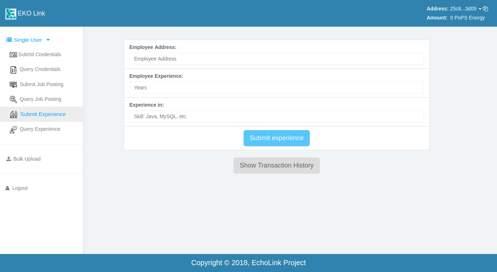
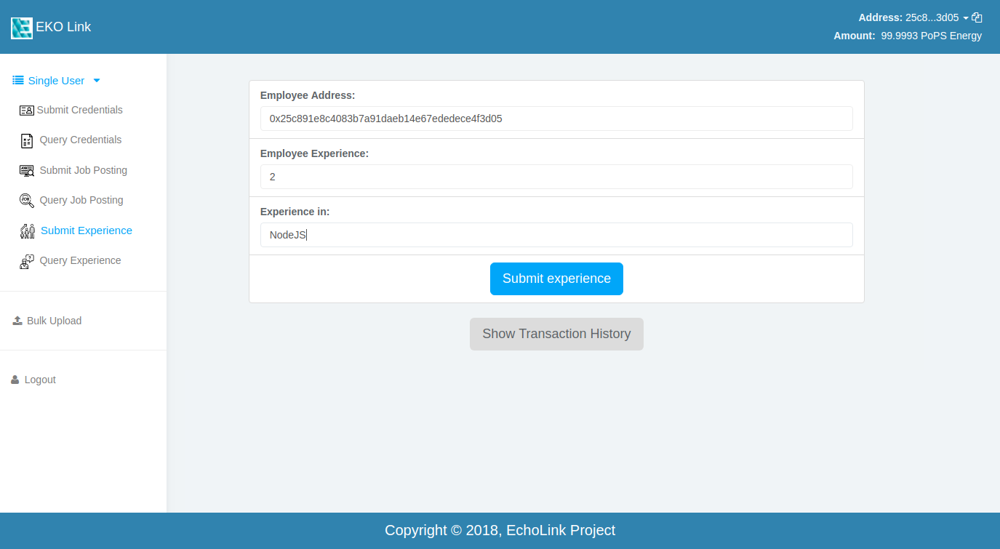
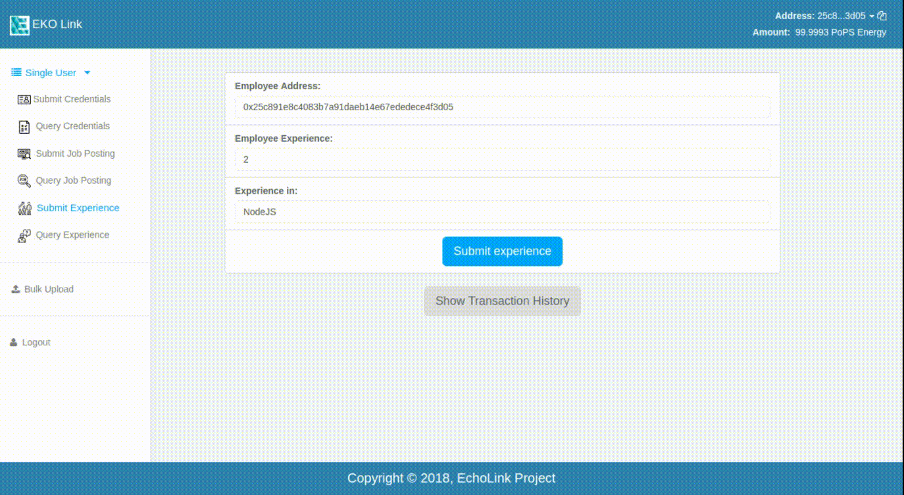

Post Experience
---------------

This is page where you can post your experience to our EKO-Pops Node.

Let's add some data and upload the experience

Here you can see the demo of how the transaction hash is generated for our transaction on the network. You can retrive the transaction hash and check the status on our node or the status of the transaction will be shown at the end of the transaction as you'll see below.

For a successful transaction, you need to have your account address approved by the admin and then have some token energy. You can see the token being energy updated at the top right corner with the successful transaction. Once you've done the transaction, you can see the history of the transactions with time and status by clicking on :code:`Show Transactions history` button. If any transaction fails, you'll have an option to resubmit that transaction without having to enter the credentials again. And if the transaction is successful, you'll see the the updated time and status in the transaction history table.
