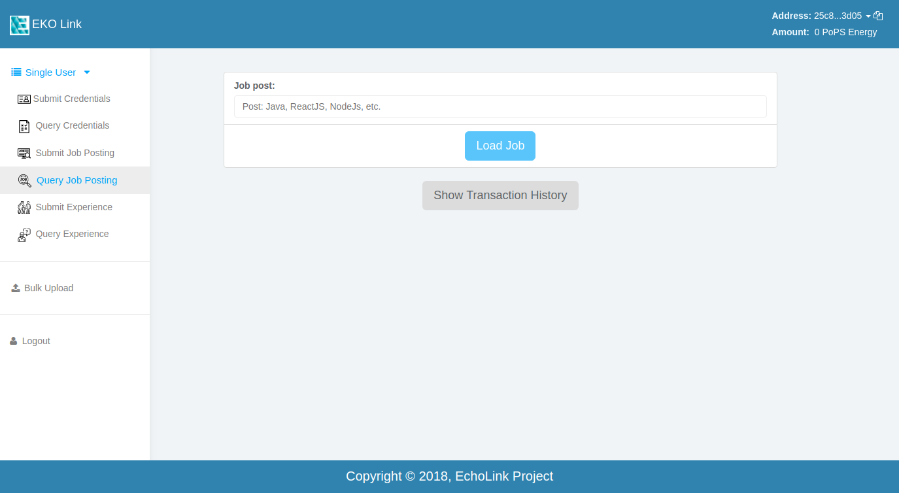
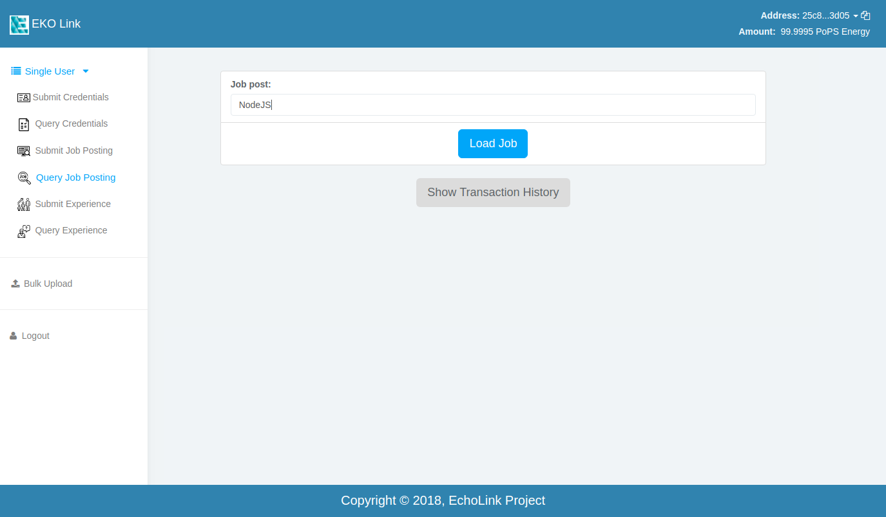

Query Job
---------

In this section of our application you can search for the job on our EKO-Pops Node. The image below shows the screenshot of the page.

Let's find the job which we posted in our previous section on :doc:`post job <post_job>`.

Here you can see the demo of how you can retrive a posted job, data will be displayed when the correct job name is entered.

.. figure:: images/query_jobpost.gif
   :alt: Jobpost Query Demo

Here you can preview the jobs on the network and the address of the ones who posted it. Also, Once you've done the transaction, you can see the history of the transactions with time and address by clicking on :code:`Show Transactions history` button.
