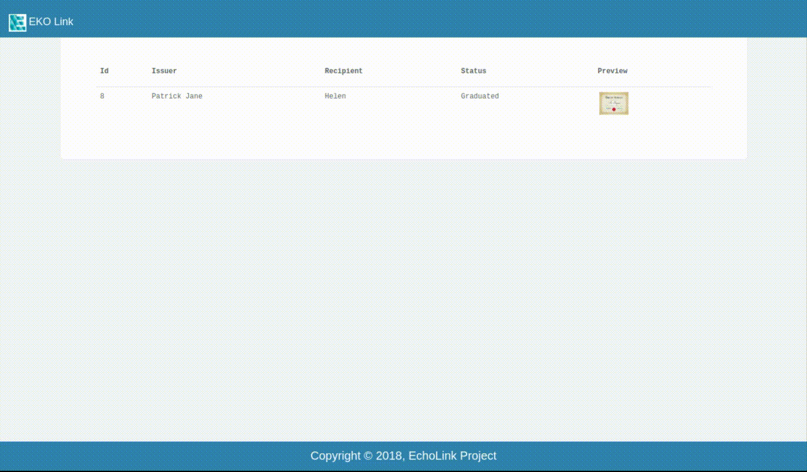

Query Credentials
-----------------

In this section of our application you can query the credentials you've uploaded on our network to the blockchain. The image below shows the screenshot of the page.

.. figure:: images/query_credentials.png
   :alt: Credentials Query

Let's query the credentials which we uploaded in our previous section on :doc:`upload credentials <credentials_upload>`.

.. figure:: images/query_credentials_demo.png
   :alt: Credentials Query Demo

Here you can see the demo of how you can retrive your credentials, data will be displayed when the correct status is entered.

.. figure:: images/query_credentials.gif
   :alt: Credentials Query Demo

Here you can preview the image you've uploaded with your credentials and can download it in your local system. Also, Once you've done the transaction, you can see the history of the transactions with time and address by clicking on :code:`Show Transactions history` button.

View Credentials: User Profile
^^^^^^^^^^^^^^^^^^^^^^^^^^^^^^

You can see on the demo above, there's :code:`view credential` option below the image you queried. Clicking on that will lead you to a new page which can serve as your public profile. You can access it anywhere without having to login.

The profile page will look like the one below.

