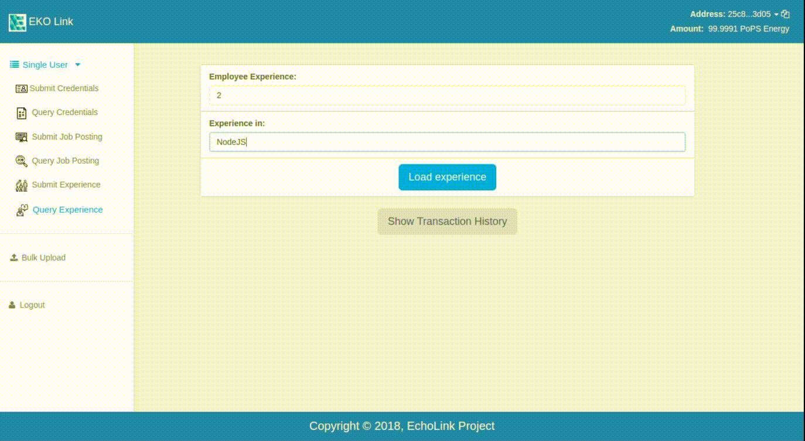

Query Experience
----------------

In this section of our application you can search for the addresses of people who match the experience and the job needs on our EKO-Pops Node. The image below shows the screenshot of the page.

.. figure:: images/query_experience.png
   :alt: Experience Query

Let's find the experience information which we posted in our previous section on :doc:`post experience <post_experience>`.

.. figure:: images/query_experience_demo.png
   :alt: Experience Query Demo

Here you can see the demo of how you can retrive a posted experience, data will be displayed when the correct experience details are entered.

Here you can preview the addresses of required experience and the address of the ones who posted it. Also, Once you've done the transaction, you can see the history of the transactions with time and address by clicking on :code:`Show Transactions history` button.
