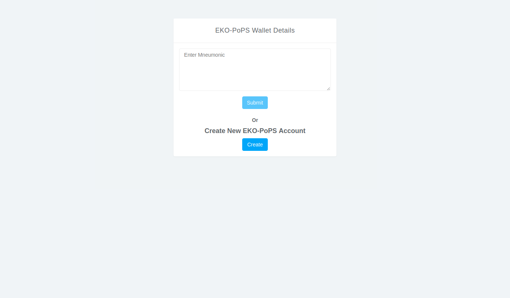
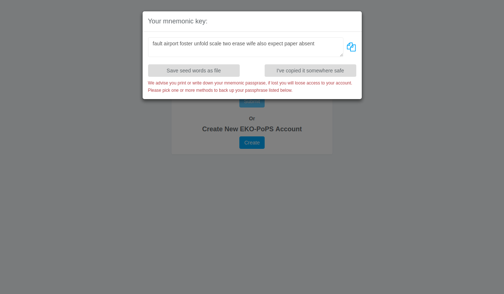

Registration and Authentication
-------------------------------
When you browse to the link you will be shown a login page like the one below.

You should have a private account with mnemonic key or priv_key to start a transaction. 
If you don't already have one, you create a new account by clicking the :code:`create` button, this will show you the screen like the one below.

It is important that you retrive your new mnemonic key somewhere safe, you can also download the key as the text file. Then you need to click on to :code:`I've copied it somewhere safe` and enter your mnemonic.

The demo below shows how successful login using mnemonic leads to your dashboard

.. figure:: images/login_demo.gif
   :alt: Login page Demo
